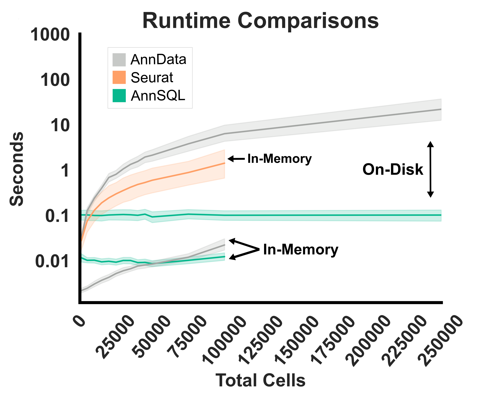

<center></center>
<br />

# Query AnnData Objects with SQL
The AnnSQL package enables SQL-based queries on [AnnData](https://anndata.readthedocs.io/en/latest/) objects, returning results as either a [Pandas](https://pandas.pydata.org/) DataFrame, an AnnData object, or a [Parquet](https://parquet.apache.org/) file that can easily be imported into a variety of data analysis tools. Behind the scenes, AnnSQL converts the layers of an AnnData object into a relational [DuckDB](https://duckdb.org/) database. Each layer is stored as an individual table, allowing for simple or complex SQL queries, including table joins.

To get started, see the usage notes below or refer to the example scripts in the `examples` directory.

## Features
- Query AnnData with **SQL**.
- Return query results as **Pandas** Dataframes, **Parquet** files, or **AnnData** objects.
- Create in-memory or on-Disk databases directly from AnnData objects.
- **Fast** for complex queries and aggregative functions.

## Installation
```
pip install annsql
```

## Basic Usage (In-Memory)
Ideal for smaller datasets.
```python
from AnnSQL import AnnSQL
import scanpy as sc

#read sample data
adata = sc.datasets.pbmc68k_reduced()

#instantiate the AnnData object (you may also pass a h5ad file to the adata parameter)
adata_sql = AnnSQL(adata=adata)

#query the expression table. Returns Pandas Dataframe by Default
adata_sql.query("SELECT * FROM X")

#query the observation table. Returns adata object.
adata_sql.query("SELECT * FROM obs", return_type="adata")

#query the join of 'X' and 'obs' table
adata_sql.query("SELECT * FROM adata", return_type="parquet")
```


## Basic Usage (On-Disk)
For larger datasets, AnnSQL can create a local database (asql) from the AnnData object. This database is stored on-disk and queried. Storage requirements are similar to the original AnnData h5ad filesize; however, complex aggregative functions can now benefit from the DuckDb engine with full SQL support. Please see <a href="#">manuscript</a> for benchmarks.
```python
import scanpy as sc
from MakeDb import MakeDb

#read sample data
adata = sc.datasets.pbmc68k_reduced()

#build the AnnSQL database
MakeDb(adata=adata, db_name="pbmc3k_reduced", db_path="db/")

#open the AnnSQL database
adata_sql = AnnSQL(db="db/pbmc3k_reduced.asql")

#query the expression table
adata_sql.query("SELECT * FROM adata")
```

## Entity Relationship Diagram
Using the [Scanpy](https://scanpy.readthedocs.io/) sample dataset, "Processed 3k PBMCs from 10x Genomics," the following ERD was generated from the DuckDB database constructed via **AnnSQL**, based on the corresponding AnnData object. **Note:** The database structure is not optimized for performance. Instead, the tables are designed to closely mirror the familiar structure of the AnnData object for ease of use.
```bash
AnnData object with n_obs × n_vars = 700 × 765
    obs: 'bulk_labels', 'n_genes', 'percent_mito', 'n_counts', 'S_score', 'phase', 'louvain'
    var: 'n_counts', 'means', 'dispersions', 'dispersions_norm', 'highly_variable'
    uns: 'bulk_labels_colors', 'louvain', 'louvain_colors', 'neighbors', 'pca', 'rank_genes_groups'
    obsm: 'X_pca', 'X_umap'
    varm: 'PCs'
    obsp: 'distances', 'connectivities'
```


## Advanced Queries and usage
```python
from AnnSQL import AnnSQL
import scanpy as sc

#read sample data
adata = sc.datasets.pbmc68k_reduced()

#pass the AnnData object to the AnnSQL class
adata_sql = AnnSQL(adata=adata)

#group and count all labels
adata_sql.query("SELECT obs.bulk_labels, COUNT(*) FROM obs GROUP BY obs.bulk_labels")

#take the log10 of a value
adata_sql.query("SELECT LOG10(HES4) FROM X WHERE HES4 > 0")

#sum all gene counts
adata_sql.query("SELECT SUM(COLUMNS(*)) FROM (SELECT * EXCLUDE (cell_id) FROM X)")

#taking the correlation of genes ITGB2 and SSU72 in dendritic cells that express either gene > 0
adata_sql.query("SELECT corr(ITGB2,SSU72) as correlation FROM adata WHERE bulk_labels = 'Dendritic' AND (ITGB2 > 0 OR SSU72 >0)")

```


## AnnSQL Class

<table>
  <thead>
    <tr>
      <th>Method</th>
      <th>Parameters</th>
      <th>Description</th>
    </tr>
  </thead>
  <tbody>
    <tr>
      <td><code>__init__(adata, db, layers, create_all_indexes)</code></td>
      <td>
          <li><code>adata</code>: AnnData object or h5ad filepath (optional)</li>
          <li><code>db</code>: Path to DuckDB database (optional)</li>
		  <li><code>layers</code>: List (optional. default: ["X", "obs", "var", "var_names", "obsm", "varm", "obsp", "uns"]).<i>The layers of the Anndata object to build into the database. For larger datasets, it may be beneficial to only include the layers you're interested in querying.</i></li>
          <li><code>create_basic_indexes</code>: Build indexed on cell_id (optional. default: False)</li>
		  <li><code>create_all_indexes</code>: Boolean (optional. default: False). <i>Warning: Runtime can be significant when building.</i></li>
      </td>
      <td>Initializes the AnnSQL object. Requires either a AnnData object (<code>adata</code>) or a DuckDB database path (<code>db</code>).</td>
    </tr>
    <tr>
      <td><code>query(query, return_type)</code></td>
      <td>
          <li><code>query</code>: SQL query string</li>
          <li><code>return_type</code>: 'pandas', 'adata', or 'parquet' (default: 'pandas')</li>
      </td>
      <td>Executes a SELECT SQL query. Returns results as a pandas DataFrame, AnnData object, or parquet file.</td>
    </tr>
    <tr>
      <td><code>query_raw(query)</code></td>
      <td>
          <li><code>query</code>: SQL query string</li>
      </td>
      <td>Executes a raw SQL query without restrictions on the type of query. Returns the raw result of the query.</td>
    </tr>
    <tr>
      <td><code>update_query(query)</code></td>
      <td>
          <li><code>query</code>: SQL update, delete, or insert query</li>
      </td>
      <td>Executes an UPDATE, DELETE, or INSERT SQL query. Raises an error if a SELECT query is detected.</td>
    </tr>
    <tr>
      <td><code>show_tables()</code></td>
      <td><li>None</li></td>
      <td>Displays the list of all tables in the DuckDB instance.</td>
    </tr>
    <tr>
      <td><code>show_settings()</code></td>
      <td><li>None</li></td>
      <td>Returns the current DuckDB settings in a pandas DataFrame format.</td>
    </tr>
    <tr>
      <td><code>export_parquet()</code></td>
      <td><li>None</li></td>
      <td>Exports all tables in the DuckDB database to individual Parquet files, saved in the <code>parquet_files</code> folder.</td>
    </tr>
  </tbody>
</table>

## MakeDb Class
<table>
  <thead>
    <tr>
      <th>Method</th>
      <th>Parameters</th>
      <th>Description</th>
    </tr>
  </thead>
  <tbody>
    <tr>
      <td><code>__init__(adata, db_name, db_path, layers, create_all_indexes)</code></td>
      <td>
          <li><code>adata</code>: AnnData object (required)</li>
          <li><code>db_name</code>: Name for the database (required)</li>
          <li><code>db_path</code>: Path to store the database (default: 'db/')</li>
		  <li><code>layers</code>: List (optional. default: ["X", "obs", "var", "var_names", "obsm", "varm", "obsp", "uns"]).<i>The layers of the Anndata object to build into the database. For larger datasets, it may be beneficial to only include the layers you're interested in querying.</i></li>
          <li><code>create_basic_indexes</code>: Build indexed on cell_id (optional. default: False)</li>
		  <li><code>create_all_indexes</code>: Boolean (optional. default: False). <i>Warning: Runtime can be significant when building.</i></li>
		  <li><code>convenience_view</code>: Boolean (optional. default: True). <i>Creates the view 'adata' by joining the X and obs tables. For larger datasets, consider setting this flag to False to save resources.</i></li>
      </td>
      <td>Initializes the MakeDb object and validates parameters, then proceeds to build the DuckDB database.</td>
    </tr>
  </tbody>
</table>


<br>
<br>

## Usage & Runtime Notes
There are two key reasons to use **AnnSQL**: (1) if you prefer SQL's expressive syntax for filtering and querying your data, or (2) if you're working with datasets that exceed memory limits and require loading AnnData in backed mode. Using backed mode in AnnData can limit available functions, especially aggregate operations, and slow down data access. **AnnSQL** offers a solution by enabling SQL-style queries that may perform more efficiently in these scenarios. Below are rough runtime comparisons between AnnData and AnnSQL after a database has been built. Running AnnSQL locally for datasets that are larger than memory, that would typically require AnnData in backed mode see substantial runtime improvements for a variety of filtering operations. 



#### Runtime System Details
- **Memory:**                                      40.0 GiB
- **Processor:**                                   12th Gen Intel® Core™ i7-1255U × 12
- **Disk Capacity:**                               1.0 TB
- **OS:**                                          Ubuntu 24.04.1 LTS
- **Python Version:**                              3.12

<br>
<br>

## Accessing and processing 4.4 million cells on a laptop
To illustrate how AnnSQL can be used to access atlas sized datasets on a local computer, we examine the single nuclei dataset presented in "The molecular cytoarchitecture of the adult mouse brain" by <a href='https://www.nature.com/articles/s41586-023-06818-7' target="_blank">Langlieb et al 2023</a>. First, we opened the <a href='https://docs.braincelldata.org/downloads/index.html' target="_blank">atlas</a> AnnData object in backed mode and created a `asql` database using the `MakeDb` class provided with AnnSQL. Next, we performed some basic querying of the data to return subsets. Our next step was to calculate total counts per gene which we accomplished entirely in SQL; even with the non-optimized schema. Lastly, we calculated highly variable genes in the entire dataset using two SQL queries which: (1) provide a list of all gene names in the X table, then (2) use those gene names to calculate the variance for each gene and return a list of the top 2000. Our results demonstrate AnnSQL is a capable tool for basic (and possibly more advanced) analyses of atlas scale datasets. 

```python
#import libraries
from MakeDb import MakeDb
from AnnSQL import AnnSQL

#load the atlas dataset in backed mode
adata = sc.read_h5ad("Macosko_Mouse_Atlas_Single_Nuclei.Use_Backed.h5ad", backed="r+")

#build the asql database | Runtime 7hr 10min
MakeDb(adata=adata, db_name="Macosko_Mouse_Atlas", db_path="../db/", layers=["X", "obs"])

#query example (GAD1 = ENSMUSG00000070880) | Runtime: 0.24sec
adata_sql.query("SELECT ENSMUSG00000070880 FROM X WHERE ENSMUSG00000070880 > 0")

#count the number of cells in each cluster | Runtime: 0.35sec
adata_sql.query("SELECT ClusterNm, COUNT(cell_id) AS num_cells FROM obs GROUP BY ClusterNm ORDER BY num_cells DESC")

#total counts per gene | Runtime: 2min 36sec
adata_sql.query("SELECT SUM(COLUMNS(*)) FROM (SELECT * EXCLUDE (cell_id) FROM X)") 


"""
Normalize counts to 1e4 and log
1. Get all gene column names by using the describe function | Runtime: 0.21sec
2. Pass those genes into a query in chunks to get total counts | Runtime: 4min 17sec
3. Normalize to 1e4 and log2 | Runtime: 1hr 2min
"""

#get all gene names 
gene_names = adata_sql.query(f"Describe X")['column_name'][1:].values

#add a total counts column
adata_sql.query(f"ALTER TABLE X ADD COLUMN total_counts FLOAT DEFAULT 0;")

#iterates gene_names in chunks
chunk_size = 990 #Ddb limited to 1k
for i in range(0, len(gene_names), chunk_size):
	chunk = gene_names[i:i+chunk_size]
	chunk = " + ".join(chunk) + " + total_counts"
	adata_sql.update_query(f"UPDATE X SET total_counts = ({chunk});")

#normalize to 10k and log2
chunk_size = 200  #reduces db memory usage
for i in range(0, len(gene_names), chunk_size):
	updates = []
	chunk = gene_names[i:i + chunk_size]
	for gene in chunk:
		updates.append(f"{gene} = LOG2(({gene} / total_counts) * 1e4 + 1e-5)")
	update_query = f"UPDATE X SET {', '.join(updates)}"
	adata_sql.update_query(update_query)


"""
Calculate top 2000 highly variable genes.
1. Get all gene column names by using the describe function | Runtime: 0.21sec
2. Pass those genes to query using built-in variance function. Then,
   order the results and limit to the top 2000 | Runtime: 0.21sec
"""


```

#### Runtime System Details
- **Memory:**                                      40.0 GiB
- **Processor:**                                   12th Gen Intel® Core™ i7-1255U × 12
- **Disk Capacity:**                               1.0 TB
- **OS:**                                     	   Ubuntu 24.04.1 LTS
- **Python Version:**                              3.12


<br>
<br>


## Citation
Coming soon...

<br>
<br>